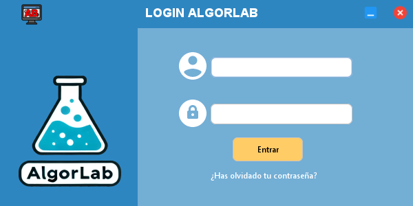
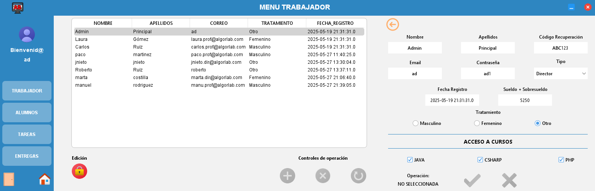
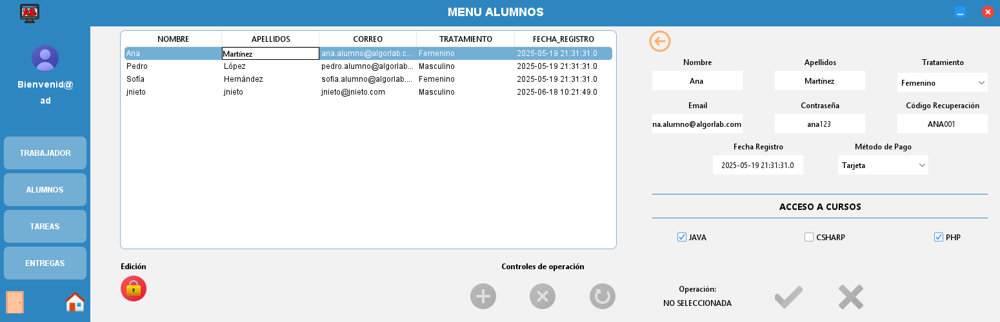
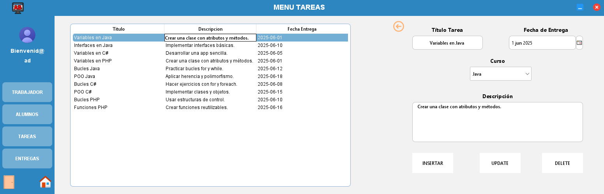
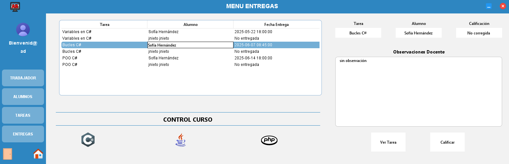
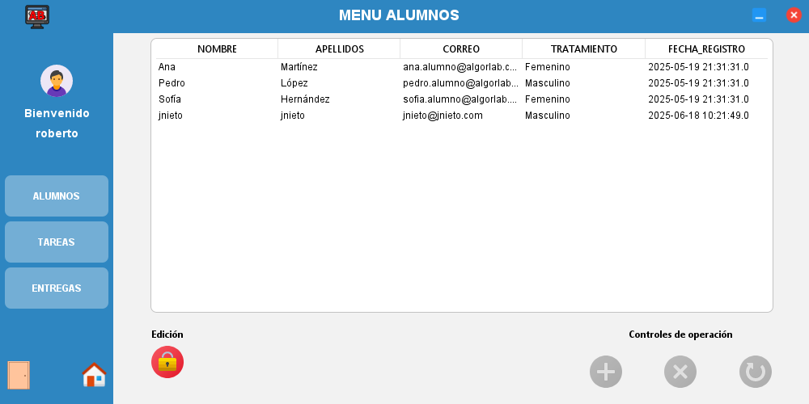

# 🧠 AlgorLab-App-Final

**AlgorLab** es una aplicación de escritorio desarrollada en **Java** para la **gestión integral de una plataforma Moodle**, orientada al **profesorado y al equipo directivo**. Además, el proyecto incluye una **web complementaria en PHP** que lo puedes encontrar en mi perfil pensada para el acceso de **alumnos**.

---

## 📁 Estructura del proyecto

```
Algorlab/
├── Algorlab-Master/     # Código fuente principal del proyecto Java
├── Database/            # Archivos de base de datos y scripts SQL
├── Dependencias/        # Librerías externas utilizadas (Java)
├── images/              # Capturas de pantalla
└── README.md            # Este archivo
```

---

## 🧩 Características principales

- Gestión de usuarios (profesores, directores, alumnos)  
- Conexión con base de datos Moodle  
- Generación de reportes académicos  
- Interfaz intuitiva para administración  
- Sincronización con la versión web en PHP (en progreso)

---

## 🖼️ Capturas de pantalla

### Login Aplicación


### Gestión de trabajadores/profesores


### Gestión de alumnos


### Gestión de tareas


### Gestión de entregas


### Vista Profesorado


---

## ⚙️ Requisitos

- **Java 22**
- **MySQL** (para la base de datos)  
- Librerías externas ubicadas en `/Dependencias`

---

## 🚀 Ejecución

1. Clonar el repositorio:
   ```bash
   git clone https://github.com/tuusuario/Algorlab.git
   ```
2. Importar el proyecto en tu IDE (Eclipse, IntelliJ, NetBeans, etc.)  
3. Añadir las dependencias desde la carpeta `/Dependencias`  
4. Configurar la base de datos desde `/Database`  
5. Ejecutar la clase principal ubicada en `/Algorlab-Master/src/algorlab/Ejecutora.java`

---

## 🌐 Versión web

El módulo web permite a los alumnos que accedan a su información y tareas mediante una interfaz PHP, conectada a la misma base de datos.

---

## 📜 Licencia

Este proyecto está bajo la licencia **MIT**. Consulta el archivo [`LICENSE`](LICENSE) para más información.

---

# 🇬🇧 English Version

**AlgorLab** is a **Java desktop application** designed for **Moodle platform management**, focused on **teachers and school directors**. A **PHP web module** for students is also being developed.

---

## 📁 Project Structure

```
Algorlab/
├── Algorlab-Master/     # Main Java project source code
├── Database/            # Database files and SQL scripts
├── Dependencias/        # External Java libraries
├── images/              # Screenshots
└── README.md            # This file
```

---

## 🧩 Main Features

- User management (teachers, directors, students)  
- Moodle database connection  
- Academic report generation  
- Intuitive admin interface  
- Synchronization with the PHP web module

---

## 🖼️ Screenshots

### Application Login


### Staff/Teacher Management


### Student Management


### Task Management


### Submission Management


### Teacher View


---

## ⚙️ Requirements

- **Java 22**
- **MySQL / MariaDB**  
- External libraries inside `/Dependencias`

---

## 🚀 How to Run

1. Clone the repository:
   ```bash
   git clone https://github.com/yourusername/Algorlab.git
   ```
2. Import the project into your IDE  
3. Add dependencies from `/Dependencias`  
4. Set up the database from `/Database`  
5. Run the main class inside `/Algorlab-Master/src/algorlab/Ejecutora.java`

---

## 🌐 Web Module

The web module allow students to log in and view their academic information and task using php using the same database.

---

## 📜 License

This project is licensed under the **MIT License**. See [`LICENSE`](LICENSE) for details.
